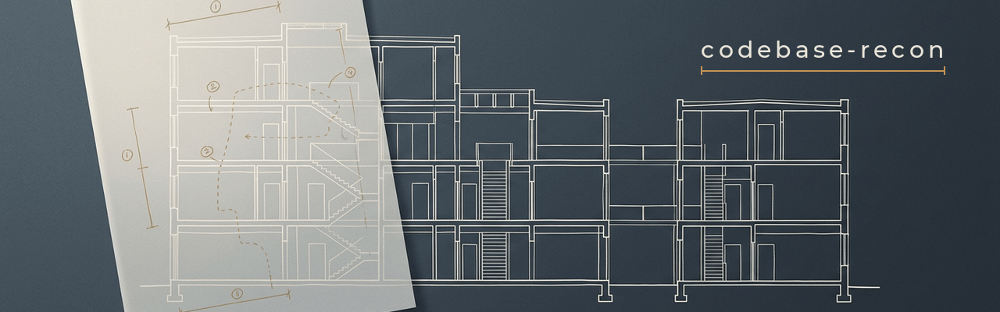

<h1 align="center">
  
</h1>

<p align="center">
  Read a codebase you did not write, before you change it.<br>
  Every claim carries <code>file:line</code>. Nothing gets edited except the report.
</p>

<p align="center">
  <a href="https://skills.sh/sumanrox/codebase-recon/codebase-recon"></a>
  <a href="LICENSE"></a>
</p>

```bash
npx skills add sumanrox/codebase-recon -g
```

Then ask your agent to map the repo. It writes an architecture report covering structure, execution flows, the data and state model, concurrency, security boundaries, invariants, coupling, and where new work fits.

The point is not the summary. It is the evidence. A recon report you cannot check against a line of source is a guess in a report's clothing, and every decision you build on it inherits the guess.

## What it's for

You have just inherited a repository, or you are about to extend one you have never read. You want a map before you touch anything.

Any of these will start it:

```
Do recon on this repo before we touch anything.
I'm inheriting this codebase. Map the architecture.
Explain how this system actually works end to end.
What would break if I added a second payment provider?
```

In Claude Code you can also call it directly with `/codebase-recon`.

It is the wrong tool for a single-file question, one failing test, or a diff review. Those want a normal answer, not a survey.

## What comes back

A report at `docs/recon/YYYY-MM-DD-architecture-recon.md`, delivered in chat at the same time. Seventeen sections: executive understanding, repository structure, system architecture, components, execution flows, data and state model, concurrency and lifecycle, security architecture, testing architecture, a dependency and coupling map, invariants and contracts, documentation-versus-code discrepancies, strengths, weaknesses, extension points, areas requiring caution, and a narrative mental model. It closes with a coverage ledger.

Flows are traced across the code rather than described file by file:

```
request enters at  routes/order.ts:44
  validated by     schema/order.ts:12
  transformed in   services/order.ts:88
  persisted via    repo/order.ts:31
  enqueues         jobs/fulfil.ts:19
  response shaped  routes/order.ts:71
```

A per-file inventory is not architecture. The seams between the files are.

Three rules keep the report honest.

*Evidence.* Every claim of substance names a path and a line, or a symbol. If you cannot point at it, you do not get to claim it.

*Labels.* Each conclusion is marked Verified, meaning the agent read it; Interpretation, meaning it was inferred, and from what; or Unclear, meaning what is missing and where that evidence would live. Passing interpretation off as fact is the worst thing this skill could do to you, because you will act on it.

*Coverage.* The ledger says what went unread and why. On a large repo that list will be long, and saying so tells you where the remaining risk sits. Claimed coverage that never happened poisons everything downstream.

## How it runs

| Phase | What happens |
|---|---|
| 0. Orient | The main agent maps the tree, manifests, docs, entry points, config and size itself. This part is never delegated: hand it off before you know the shape of a repo and you get subagents searching the wrong places. |
| 1. Partition | Anything too large for one context window gets split across three to seven read-only subagents, one per subsystem, all spawned at once. Under roughly 150 source files it just reads the thing directly. |
| 2. Cross-cutting | The main agent verifies by hand what no subagent can report on: invariants and state machines, concurrency and lifecycle, security boundaries, error propagation and shutdown, and any place the docs, tests, config and code disagree. |
| 3. Synthesize | The report gets written and delivered. |
| 4. Stop | The report is the end state. No refactor pitch, no implementation, no rolling into a build workflow. |

Phase 2 exists because those answers span subsystem boundaries by definition, so stitching them together from independent reports produces something confident and wrong.

## The read-only contract

Recon happens because someone does not yet trust their own understanding enough to change the code. Editing during recon destroys the thing being measured.

The skill writes exactly one file: the report. Ask it mid-run to fix a bug it just found, refactor, run a formatter, `git add`, `git commit`, branch, or install a dependency, and it refuses and tells you why. The finding goes in the report instead.

Reading is unrestricted. `cat`, `grep`, `find`, `git log`, `git show`, `git blame`, dependency listings: all fair game, because reading history is reconnaissance, not modification. If a build or a test run would settle something genuinely unclear, it asks first, since plenty of test suites have side effects.

## Install

With the [`skills` CLI](https://github.com/vercel-labs/skills), which supports Claude Code, Codex, Cursor, OpenCode and about 70 other agents:

```bash
# into the current project
npx skills add sumanrox/codebase-recon

# globally, available everywhere
npx skills add sumanrox/codebase-recon -g

# no prompts, one agent
npx skills add sumanrox/codebase-recon -g -a claude-code -y
```

The CLI's own docs cover the full agent list and how it authenticates against private repositories.

As a Claude Code plugin:

```
/plugin marketplace add sumanrox/codebase-recon
/plugin install codebase-recon@codebase-recon
```

By hand, if you would rather see what you are installing:

```bash
git clone https://github.com/sumanrox/codebase-recon.git
ln -s "$PWD/codebase-recon/skills/codebase-recon" ~/.claude/skills/codebase-recon
```

Or run it once and install nothing:

```bash
npx skills use sumanrox/codebase-recon@codebase-recon --agent claude-code
npx skills use sumanrox/codebase-recon@codebase-recon | claude
```

## Layout

```
skills/codebase-recon/
├── SKILL.md                      workflow: phases, contracts, disciplines
└── references/
    ├── inspection-domains.md     12 probe checklists, loaded per domain
    ├── report-template.md        the 17-section report structure
    ├── subagent-briefs.md        dispatch brief and partitioning rules
    └── standalone-prompt.md      the whole workflow as one pasteable prompt
```

The reference files load on demand, so a session that never spawns subagents never pays for the dispatch brief.

## Running it somewhere else

`skills/codebase-recon/references/standalone-prompt.md` is the entire workflow as a single prompt for any agentic tool with filesystem and shell access. Replace `<REPO PATH>` and paste.

That prompt hands a model real access to your machine. Read its scope locks, its forbidden actions and its stop condition, and check the path points where you think it does, before you send it.

## License

MIT. See [LICENSE](LICENSE).
